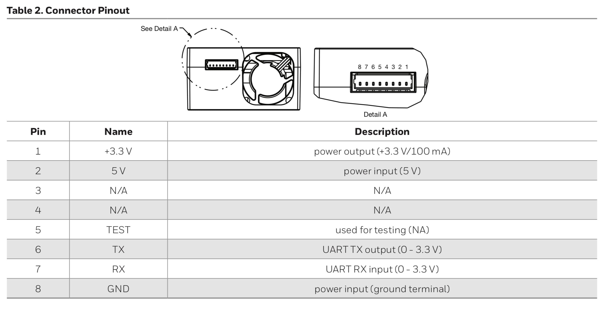

# Python-HPMA115S0
 Honeywell HPMA115S0-XXX - PM2.5 Particle Sensor with UART output

Read data(PM2.5 and PM10) from sensor and save to sqlite DB.
Tested on Raspberry Pi. 

Check if "Serial" is enabled: "sudo raspi-config" in the terminal and selecting "Interfacing options" and then "Serial”.

The pySerial library is required:

+ `python -m pip install pyserial`

## Connection
HPMA115S0 Pin – Raspberry Pi Pin
+ Pin 2 (Power input of 5V) – 5V
+ Pin 6 (UART TX) – GPIO 10
+ Pin 7 (UART RX) – GPIO 8
+ Pin 8 (Power Ground Terminal) – GND

HPMA115S0 Pinout:

I use such as these: P8 version https://www.aliexpress.com/item/10Pcs-XH-1-25-28AWG-JST-Double-Electronic-Wire-Connectors-2-3-4-5-6-7/32860186022.html. The cables from the PMS5003 / PMS7003 sensors fit into the HPMA115S0.

